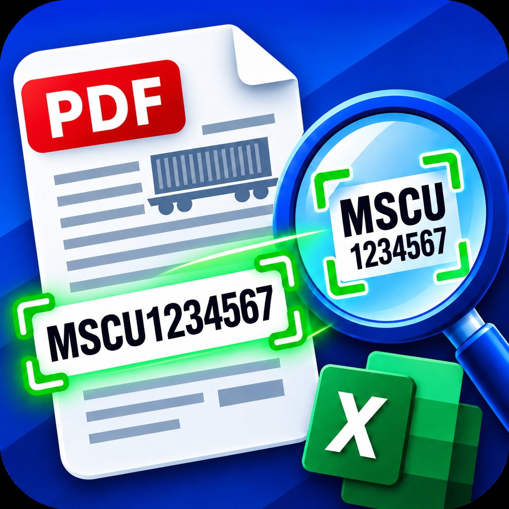

# ContainerScan

<p align="center">
  
</p>

<p align="center">
  <strong>Распознавание контейнерных номеров в PDF, сопоставление с реестром и обработка документов.</strong>
</p>

<p align="center">
  <a href="https://github.com/vanitoo/container-scan/actions/workflows/ci.yml"></a>
  <a href="https://github.com/vanitoo/container-scan/actions/workflows/build-check.yml"></a>
  <a href="https://github.com/vanitoo/container-scan/actions/workflows/pip-audit.yml"></a>
  <a href="https://github.com/vanitoo/container-scan/actions/workflows/codeql.yml"></a>
  <a href="https://github.com/vanitoo/container-scan/actions/workflows/bandit.yml"></a>
</p>

<p align="center">
  
  
  
  
  
</p>

## О проекте

**ContainerScan** — настольное приложение для автоматизации обработки PDF-бланков с контейнерными номерами.

Программа помогает пройти весь рабочий сценарий в одном интерфейсе:

1. загрузить один или несколько PDF-файлов;
2. выбрать область, в которой находится номер контейнера;
3. распознать номер с помощью OCR;
4. сопоставить распознанный номер с данными из Excel/CSV-реестра;
5. проверить результат сопоставления и использовать данные реестра для дальнейшей обработки документов.

Основной формат контейнерного номера:

```text
MSCU1234567
```

## Возможности

- загрузка одного PDF или группы PDF;
- автоматическое объединение нескольких PDF во временный документ;
- просмотр и навигация по страницам;
- поворот текущей страницы на 90° влево или вправо;
- ручное выделение области распознавания;
- перенос выбранной области между страницами с анализом расположения элементов;
- OCR контейнерных номеров через Tesseract;
- базовая и расширенная предобработка изображения с OpenCV;
- массовое распознавание страниц;
- проверка номера по регулярному выражению;
- загрузка реестра из XLSX и CSV;
- точное и частичное сопоставление распознанных номеров с реестром;
- поиск связанных данных по найденному контейнеру;
- debug-режим для диагностики распознавания;
- проверка обновлений приложения.

## OCR

Рабочий OCR-движок — **Tesseract OCR**.

В проекте уже выделен общий интерфейс OCR-движков и подготовлены адаптеры для:

- Tesseract — используется сейчас;
- EasyOCR — адаптер подготовлен, движок пока не подключён к рабочему распознаванию;
- PaddleOCR — адаптер подготовлен, движок пока не подключён к рабочему распознаванию.

Для повышения качества распознавания используются OpenCV и несколько вариантов предобработки изображения.

## Требования

- Python `3.11+`;
- Poetry;
- Tesseract OCR;
- Windows — основная целевая платформа приложения.

Основные Python-зависимости:

- OpenCV;
- PyMuPDF;
- NumPy;
- Pillow;
- pytesseract;
- openpyxl;
- Tkinter / sv-ttk.

Актуальные ограничения версий находятся в `pyproject.toml`.

## Установка для разработки

Установить Poetry, если его ещё нет:

```bash
pipx install poetry
```

Установить зависимости проекта:

```bash
poetry install --with dev
```

Tesseract OCR устанавливается отдельно.

На Windows приложение проверяет стандартные расположения Tesseract, включая:

```text
C:/Program Files/Tesseract-OCR/tesseract.exe
C:/Program Files (x86)/Tesseract-OCR/tesseract.exe
%USERPROFILE%/AppData/Local/Tesseract-OCR/tesseract.exe
%USERPROFILE%/AppData/Local/Programs/Tesseract-OCR/tesseract.exe
```

## Запуск

```bash
poetry run python run.py
```

Для быстрого запуска в Windows также можно использовать:

```text
START.cmd
```

## Сборка EXE

Для локальной сборки используется PyInstaller:

```text
compile.cmd
```

Сборка выполняется из `run.py` с добавлением каталога `src`.

## Структура проекта

```text
.
├── run.py
├── pyproject.toml
├── poetry.lock
├── compile.cmd
├── release.ps1
├── icon.ico
├── icon.png
├── CHANGELOG.md
└── src/
    └── pdf_ocr_app/
        ├── app.py
        ├── config.py
        ├── version.py
        ├── gui/
        ├── models/
        ├── services/
        │   ├── pdf_service.py
        │   ├── excel_service.py
        │   ├── matching_service.py
        │   ├── ocr_service.py
        │   └── ocr/
        │       ├── base.py
        │       ├── preprocessing.py
        │       ├── tesseract_engine.py
        │       ├── easyocr_engine.py
        │       └── paddleocr_engine.py
        └── utils/
```

## Архитектура

Приложение разделено на несколько основных частей:

- **GUI** — интерфейс и действия пользователя;
- **PDFService** — загрузка, объединение, отображение, поворот и обработка PDF;
- **OCRService** — распознавание и нормализация контейнерных номеров;
- **OCR engines** — отдельный слой OCR-движков и предобработки;
- **ExcelService** — загрузка XLSX/CSV-реестра;
- **MatchingService** — сопоставление OCR-результатов с ожидаемыми контейнерами;
- **AppState** — текущее состояние приложения.

## Настройки OCR

Часть настроек может задаваться через `.env`, например координаты области и регулярное выражение:

```env
X_START=14
Y_START=280
X_END=77
Y_END=330
REGEX_PATTERN=^[A-Z]{3}U\d{7}$
```

Строгий шаблон соответствует формату:

```text
AAA U 1234567
```

без пробелов:

```text
AAAU1234567
```

## Разработка

Проверка кода:

```bash
poetry run ruff check .
```

Форматирование:

```bash
poetry run ruff format .
```

Проверка тестов и безопасности:

```bash
poetry run pytest
poetry run bandit -r src/pdf_ocr_app -ll
poetry run pip-audit
```

## CI и безопасность

При каждом push в `master` и для pull request независимые GitHub Actions запускаются параллельно:

- **Python CI** — критические проверки Ruff, компиляция, импорт пакета и pytest;
- **Build EXE** — контрольная сборка Windows EXE через PyInstaller;
- **Bandit** — статический анализ безопасности Python-кода;
- **pip-audit** — проверка установленных зависимостей на известные уязвимости;
- **CodeQL** — углублённый анализ кода средствами GitHub Code Scanning.

Статус каждой проверки отображается отдельным badge в начале README. Релизная сборка остаётся отдельным workflow и запускается только при публикации тега версии.

## Релиз

Версия приложения хранится в `pyproject.toml` и `src/pdf_ocr_app/version.py`.

Релиз создаётся через PowerShell-скрипт:

```powershell
powershell -NoProfile -ExecutionPolicy Bypass -File .\release.ps1 2.0.6
```

Перед релизом рабочее дерево должно быть чистым. Скрипт синхронизирует версию, обновляет lock-файл, создаёт release-коммит и тег, после чего отправляет изменения в GitHub.

История изменений находится в [CHANGELOG.md](CHANGELOG.md).

## Технологии

**Python · Tkinter · OpenCV · PyMuPDF · Tesseract OCR · NumPy · Pillow · OpenPyXL · Poetry · PyInstaller**

## Автор

Разработка: [@vanitoo](https://github.com/vanitoo)

Лицензия: [MIT](LICENSE)
